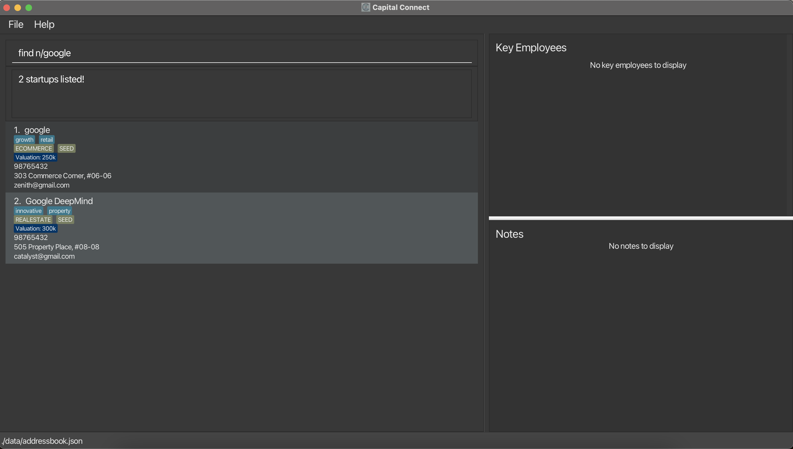
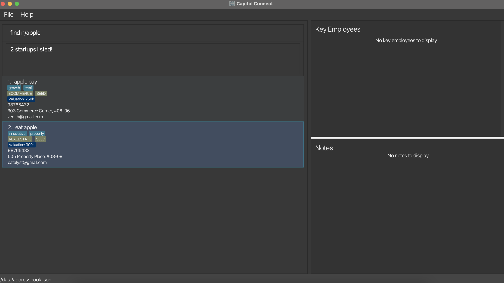
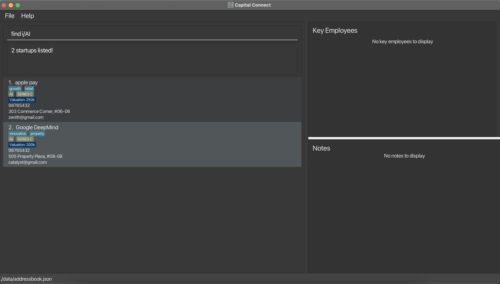
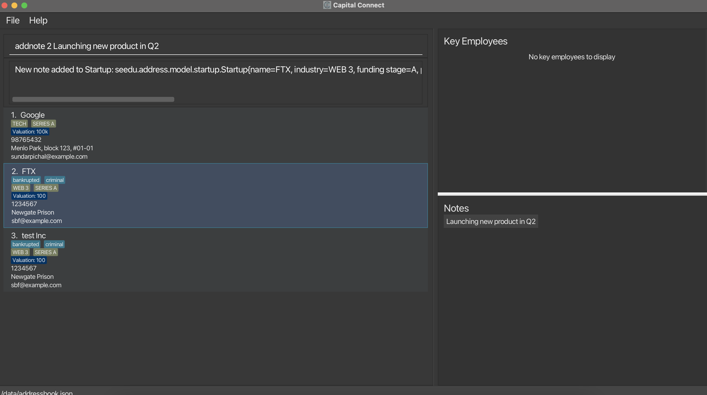
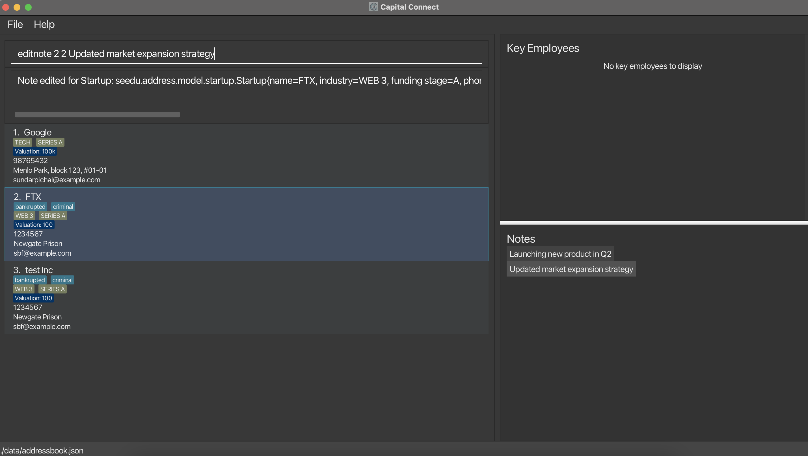
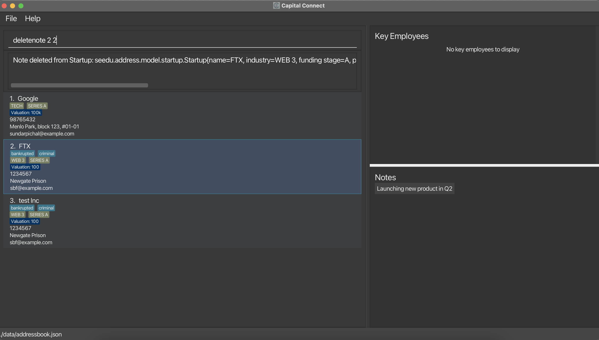

# CapitalConnect User Guide

**Welcome to CapitalConnect: Your Portfolio Powerhouse!**

Do you ever feel like your startup portfolio is a tangled mess of spreadsheets and endless documents? You're not alone.
As a Venture Capital Portfolio Manager, juggling diverse investments across industries can be a complex challenge.

**Who are you?**

Our application is build for the aspiring venture capitalist! You are a professional on the lookout for the next Google.
You are passionate about innovative and new technologies. Most importantly, you want to **make your network your net-worth.**

**CapitalConnect is here to revolutionize your experience**.

As a desktop app for managing startup investments and contacts, CapitalConnect is optimized
for use via **a Line Interface (CLI)** while still having the benefits of a Graphical User Interface (GUI). If you can
type fast, CapitalConnect can get your investment management done faster than traditional GUI apps.

We streamline and wrap **everything** in a sleek, easy to use platform. And by everything, we mean everything from

- Adding new startups to your watch list!
- Tracking the profile of various startups!
- Categorising and searching for startups based on your requirements!

and much, much, more!

This user guide is your key to unlocking the full potential of the app.  We'll walk you through every step, from
effortlessly adding new investments to categorizing them by industry and funding stage.  Forget the days of chasing
down data – CapitalConnect empowers you to track your startup investments with ease.

Throughout this guide, we'll use clear, step-by-step instructions and helpful screenshots to ensure you master
CapitalConnect in no time.  So, buckle up and get ready to experience a smoother, more efficient way to manage your
startup investments!

--------------------------------------------------------------------------------------------------------------------

## Table Of Contents

<!-- * Table of Contents -->
<page-nav-print />

--------------------------------------------------------------------------------------------------------------------

## Quick start

1. Ensure you have Java `11` or above installed in your Computer.

1. Download the latest `capitalconnect.jar` from [here](https://github.com/AY2324S2-CS2103T-W09-2/tp).

1. Copy the file to the folder you want to use as the _home folder_ for CapitalConnect.

1. Open a command terminal, `cd` into the folder you put the jar file in, and use the `java -jar capitalconnect.jar` command to run the application. 
   A GUI similar to the below should appear in a few seconds. Note how the app contains some sample data. 
   

1. Type the command in the command box and press Enter to execute it. e.g. typing **`help`** and pressing Enter will open the help window. 
   Some example commands you can try:

   * `list` : Lists all startups.

   * `add n/Pichu p/98765432 i/finance v/10 f/B e/pichuhr@example.com a/pichu street, block 123, #01-01` : Adds a startup called `Pichu` to CapitalConnect.

   * `delete 3` : Deletes the 3rd startup shown in the current list.

   * `clear` : Deletes all startups.

   * `exit` : Exits the app.

1. Refer to the [Features](#features) below for details of each command.

--------------------------------------------------------------------------------------------------------------------

## Features

<box type="info" seamless>

**Notes about the command format:** 

* Words in `UPPER_CASE` are the parameters to be supplied by the user. 
  e.g. in `add n/NAME`, `NAME` is a parameter which can be used as `add n/capital connect`.

* Items in square brackets are optional. 
  e.g `n/NAME [t/TAG]` can be used as `n/capital connect t/stealth startup` or as `n/capital connect`.

* Items with `…`​ after them can be used multiple times including zero times. 
  e.g. `[t/TAG]…​` can be used as ` ` (i.e. 0 times), `t/stealth startup`, `t/steath startup t/mvp` etc.

* Parameters can be in any order. 
  e.g. if the command specifies `n/NAME p/PHONE_NUMBER`, `p/PHONE_NUMBER n/NAME` is also acceptable.

* Extraneous parameters for commands that do not take in parameters (such as `help`, `list`, `exit` and `clear`) will be ignored. 
  e.g. if the command specifies `help 123`, it will be interpreted as `help`.

* If you are using a PDF version of this document, be careful when copying and pasting commands that span multiple lines as space characters surrounding line-breaks may be omitted when copied over to the application.
</box>

### Viewing help : `help`

Shows a message explaining how to access the help page.

Format: `help`

### Adding a startup: `add`

Adds a startup to the address book.

Format: `add n/NAME p/PHONE_NUMBER i/INDUSTRY f/FUNDING_STAGE e/EMAIL a/ADDRESS v/VALUATION [t/TAG]…​`

<box type="tip" seamless>

**Tip:** A startup can have any number of tags (including 0)
</box>

<box type="tip" seamless>

**Tip:** We only support traditional funding stages, hence inputs for `FUNDING_STAGE` must be either `S`, `PS`, `A`, `B` or `C`!
`A`, `B`, `C` represents the respective funding series whilst `PS` refers to pre-seed and `S` refers to the seed stage.
</box>

<box type="tip" seamless>

**Tip:** You can't give us blank inputs! We need you to give us a valid input for mandatory fields! Check that phone number again,
did you accidentally add a digit?
</box>

<box type="tip" seamless>

**Tip:** We understand that profitable investments requires prospecting a large range of industries. Hence, we have no restrictions on `INDUSTRY`!
We let **you** decide how specific you want to define your startup categories by! If `Tech` is too general, you can now use more specific industry categories, such as
`web 3`, `AI`, `IAAS`!
</box>

Examples:
* `add n/Google p/98765432 e/sundarpichal@example.com v/100000 a/Menlo Park, block 123, #01-01 f/A i/tech`
* `add n/FTX t/bankrupted e/sbf@example.com v/100 a/Newgate Prison p/1234567 t/criminal f/A i/web 3`

### Listing all startups : `list`

Shows a list of all startups in the address book.

Format: `list`

### Editing a startup : `edit`

Edits an existing startup in the address book.

Format: `edit INDEX [n/NAME] [p/PHONE] [v/VALUATION] [f/FUNDING_STAGE] [i/INDUSTRY] [e/EMAIL] [a/ADDRESS] [t/TAG]…​`

* Edits the startup at the specified `INDEX`. The index refers to the index number shown in the displayed startup list. The index **must be a positive integer** 1, 2, 3, …​
* At least one of the optional fields must be provided.
* Existing values will be updated to the input values.
* When editing tags, the existing tags of the startup will be removed i.e adding of tags is not cumulative.
* You can remove all the startup’s tags by typing `t/` without
    specifying any tags after it.

Examples:
*  `edit 1 p/91234567 e/stripe@example.com` Edits the phone number and email address of the 1st startup to be `91234567` and `stripe@example.com` respectively.
*  `edit 2 n/Stripe t/` Edits the name of the 2nd startup to be `Stripe` and clears all existing tags.

<box type="tip" seamless>

**Tip:** The same input rules for `add` applies here! An invalid input will throw an error.
</box>

### Locating startups by name: `find`

Finds startups with names that contain any of the given keywords.

Format: `find n/NAME [MORE_NAME]`

* The search is case-insensitive. e.g `apple` will match `Apple`
* The order of the keywords does not matter. e.g. `Jane Street` will match `Street Jane`
* Only the name is searched.
* Only full words will be matched e.g. `Microsoft` will not match `Microsofts`
* Startups matching at least one keyword will be returned (i.e. `OR` search).
  e.g. `Jane Street` will return `Jane Technologies`, `State Street`

Examples:
* `find n/Google` returns `google` and `Google Deepmind`

  

* `find n/apple` returns `apple pay`, `eat apple` 

  

### Locating startups by funding stage: `find`

Finds startups that match the funding stages you are looking for.

Format: `find f/FUNDING_STAGE [MORE_FUNDING_STAGES]`

* The search is case-insensitive. e.g `a` will match `A`
* Multiple funding stages can be looked up in a single search.
* The order of the keywords does not matter. e.g. `A B` will match `B A`
* Only the funding stage is searched.

Examples:
* `find f/C` returns startups that are currently in Series C funding

  

### Locating startups by industry: `find`

Finds startups with industries that match any of the given keywords.

Format: `find f/INDUSTRY [MORE_INDUSTRIES]`

* The search is case-insensitive. e.g `ai` will match `AI`
* Startups from multiple industries can be looked up in a single search.
* The order of the keywords does not matter. e.g. `AI WEB3` will match `WEB3 AI`
* Only the industry is searched.

Examples:
* `find i/AI` returns startups that have AI tagged within their industry.

  

### Deleting a startup : `delete`

Deletes the specified startup from CapitalConnect.

Format: `delete INDEX`

* Deletes the startup at the specified `INDEX`.
* The index refers to the index number shown in the displayed startup list.
* The index **must be a positive integer** 1, 2, 3, …​

Examples:
* `list` followed by `delete 2` deletes the 2nd startup in the address book.
* `find Betsy` followed by `delete 1` deletes the 1st startup in the results of the `find` command.

### Adding a Note to a Startup: `addnote`

Adds a note to an existing startup in the address book.

Format: `addnote INDEX NOTE`

- Adds a note to the startup at the specified `INDEX`. The index refers to the index number shown in the displayed startup list. The index **must be a positive integer** 1, 2, 3, …​
- The `NOTE` field must be provided and cannot be empty.

Examples:
- `addnote 1 Secured Series A funding` Adds a note about securing Series A funding to the 1st startup.
- `addnote 2 Launching new product in Q2` Adds a note about a product launch in Q2 to the 2nd startup.

**Tip:** Use specific and concise notes to effectively capture important information about each startup.

---

### Editing a Note of a Startup: `editnote`

Edits an existing note of a startup in the address book.

Format: `editnote INDEX NOTE_INDEX NOTE`

- Edits the note at `NOTE_INDEX` of the startup at the specified `INDEX`. Both indexes refer to the index number shown in the displayed startup list and the note list respectively. Both indexes **must be positive integers** 1, 2, 3, …​
- The `NOTE` field must be provided and cannot be empty.

Examples:
- `editnote 1 1 Revised Series A valuation` Edits the first note of the 1st startup to "Revised Series A valuation".
- `editnote 2 2 Updated market expansion strategy` Edits the second note of the 2nd startup with updated expansion strategy details.

**Tip:** Editing notes allows you to keep information about startups up to date with the latest developments.

---

### Deleting a Note from a Startup: `deletenote`

Deletes a note from an existing startup in the address book.

Format: `deletenote INDEX NOTE_INDEX`

- Deletes the note at `NOTE_INDEX` from the startup at the specified `INDEX`. Both indexes refer to the index number shown in the displayed startup list and the note list respectively. Both indexes **must be positive integers** 1, 2, 3, …​

Examples:
- `deletenote 1 1` Deletes the first note of the 1st startup.
- `deletenote 2 2` Deletes the second note of the 2nd startup.

**Tip:** Use the `deletenote` command cautiously to ensure important notes are not accidentally removed.

### Clearing all entries : `clear`

Clears all entries from CapitalConnect.

Format: `clear`

### Exiting the program : `exit`

Exits the program.

Format: `exit`

### Adding a person to a startup: `add-p`

* Adds a person to the specified startup in CapitalConnect.
* Click on the startup card that contains your new person to see the changes.

Format: `add-p INDEX pn/NAME pe/EMAIL [pd/DESCRIPTION]…​`

### Editing a person from a startup: `edit-p`

* Edits the person at the specified `PERSON_INDEX` of startup at index `INDEX`. The index refers to the index number shown in the displayed key employees and startup list respectively. The index **must be a positive integer** 1, 2, 3, …​
* At least one of the optional fields must be provided.
* Existing values will be updated to the input values.
* When editing descriptions, the existing descriptions of the startup will be removed i.e adding of descriptions is not cumulative.
* You can remove all the person’s descriptions by typing `pd/` without
  specifying any descriptions after it.
* Click on the startup card that contains your edited person to see the changes.

Format: `edit-p INDEX PERSON_INDEX [pn/NAME] [pe/EMAIL] [pd/DESCRIPTION]…​`

Examples:
*  `edit-p 1 1 pn/John pe/johndoe@example.com` Edits the name and email address of the 1st person in the 1st startup to be `John` and `johndoe@example.com` respectively.
*  `edit-p 2 1 n/Amy pd/` Edits the name of the 1st person of the 2nd startup to be `Amy` and clears all existing descriptions.

### Deleting a person from a startup: `delete-p`

* Deletes the person at `PERSON_INDEX` from the startup at the specified `INDEX`. Both indexes refer to the index number shown in the displayed startup list and the key employees list respectively. Both indexes **must be positive integers** 1, 2, 3, …​
* Click on the startup card that contains your edited person to see the changes.

Format: `delete-p INDEX PERSON_INDEX`

Examples:
- `delete-p 1 1` Deletes the 1st person of the 1st startup.
- `delete-p 2 3` Deletes the 3rd person of the 2nd startup.

### Saving the data

CapitalConnect data are saved in the hard disk automatically after any command that changes the data. There is no need to save manually.

### Editing the data file

CapitalConnect data are saved automatically as a JSON file `[JAR file location]/data/addressbook.json`. Advanced users are welcome to update data directly by editing that data file.

<box type="warning" seamless>

**Caution:**
If your changes to the data file makes its format invalid, CapitalConnect will discard all data and start with an empty data file at the next run.  Hence, it is recommended to take a backup of the file before editing it. 
Furthermore, certain edits can cause CapitalConnect to behave in unexpected ways (e.g., if a value entered is outside the acceptable range). Therefore, edit the data file only if you are confident that you can update it correctly.
</box>

--------------------------------------------------------------------------------------------------------------------

## FAQ

**Q**: How do I transfer my data to another Computer? 
**A**: Install the app in the other computer and overwrite the empty data file it creates with the file that contains the data of your previous AddressBook home folder.

--------------------------------------------------------------------------------------------------------------------

## Known issues

1. **When using multiple screens**, if you move the application to a secondary screen, and later switch to using only the primary screen, the GUI will open off-screen. The remedy is to delete the `preferences.json` file created by the application before running the application again.

--------------------------------------------------------------------------------------------------------------------

## Command summary

| Action                    | Format, Examples                                                                                                                                                                                             |
|---------------------------|--------------------------------------------------------------------------------------------------------------------------------------------------------------------------------------------------------------|
| **Add**                   | `add n/NAME p/PHONE_NUMBER f/FUNDING_STAGE v/VALUATION i/INDUSTRY e/EMAIL a/ADDRESS [t/TAG]…​`   e.g., `add n/Google p/22224444 e/larrypage@example.com a/123, menlo park, 1234665 t/SV-based i/Tech f/A` |
| **Clear**                 | `clear`                                                                                                                                                                                                      |
| **Delete**                | `delete INDEX`  e.g., `delete 3`                                                                                                                                                                          |
| **Edit**                  | `edit INDEX [n/NAME] [p/PHONE_NUMBER] [v/VALUATION] [i/INDUSTRY] [f/FUNDING_STAGE] [e/EMAIL] [a/ADDRESS] [t/TAG]…​`  e.g.,`edit 2 n/James Lee e/jameslee@example.com`                                     |
| **Find by Name**          | `find n/NAME [MORE_NAMES]`  e.g., `find n/apple`                                                                                                                                                          |
| **Find by Funding Stage** | `find f/FUNDING_STAGE [MORE_FUNDING_STAGES]`  e.g., `find f/A`, `find f/A B`                                                                                                                              |
| **Find by Industry**      | `find i/INDUSTRY [MORE_INDUSTRIES]`  e.g., `find i/AI`, `find i/AI Robotics`                                                                                                                              |
| **List**                  | `list`                                                                                                                                                                                                       |
| **Help**                  | `help`                                                                                                                                                                                                       |
| **Add Note**              | `addnote INDEX NOTE`   e.g., `addnote 1 Secured Series A funding`                                                                                                                                         |
| **Edit Note**             | `editnote INDEX NOTE_INDEX NOTE`   e.g., `editnote 1 1 Revised Series A valuation`                                                                                                                        |
| **Delete Note**           | `deletenote INDEX NOTE_INDEX`   e.g., `deletenote 1 1`                                                                                                                                                    |
| **Add Person**            | `add-p INDEX pn/NAME pe/EMAIL [pd/DESCRIPTION]…​`   e.g., `add-p 1 pn/name pe/email pd/founder`                                                                                                           |
| **Edit Person**           | `edit-p INDEX PERSON_INDEX [pn/NAME] [pe/EMAIL] [pd/DESCRIPTION]…​`   e.g., `edit-p 1 1 pn/name pe/email pd/founder`                                                                                      |
| **Delete Person**         | `edit-p INDEX PERSON_INDEX`   e.g., `delete-p 1 1`                                                                                                                                                        |   
